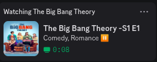
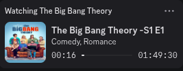
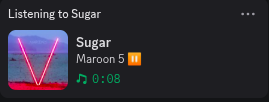
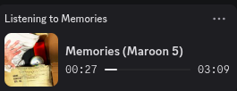
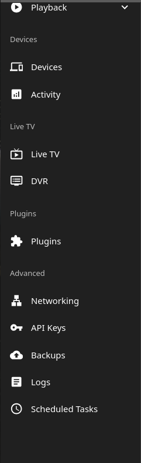
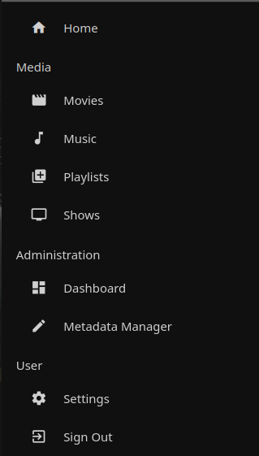
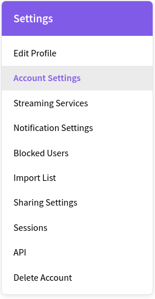
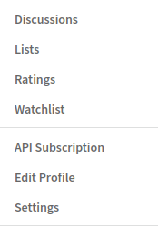

# PYTHON JELLYFIN DISCORD RPC

## Configuring the script
Install the latest versions of the imported libraries.
You only need to edit out these fields in the script
	- PIPE_PATH
	- TMDB_API_KEY
	- JELLYFIN_API_KEY
	- JELLYFIN_SERVER
	- DISCORD_API_KEY

## Generating the JELLYFIN_API_KEY
Go to the dashboard of your jellyfin server scroll down and enter into api keys. Click new api key. Give it a custom name and you'll have JELLYFIN_API_KEY and change the ip address in JELLYFIN_SERVER accordingly.

## Generating the DISCORD_API_KEY
Go to https://discord.com/developers/applications. Sign in. Click new application. Give it a custom name. Then click on the app and copy the Application ID

## Generating the TMDB_API_KEY
Go to https://www.themoviedb.org/ then sign in. Click on your profile and then click on settings. Then go to API in settings. Provide the info they're asking and then generate an API key. (Just provide those info they won't ask you for any sort of verification however you do need to verify your email while creating an account)

## Runing the script

Just run `python3 main.py`
